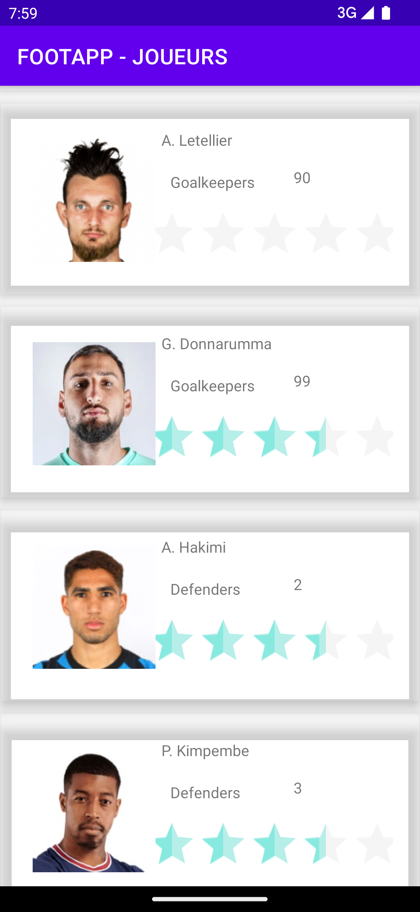
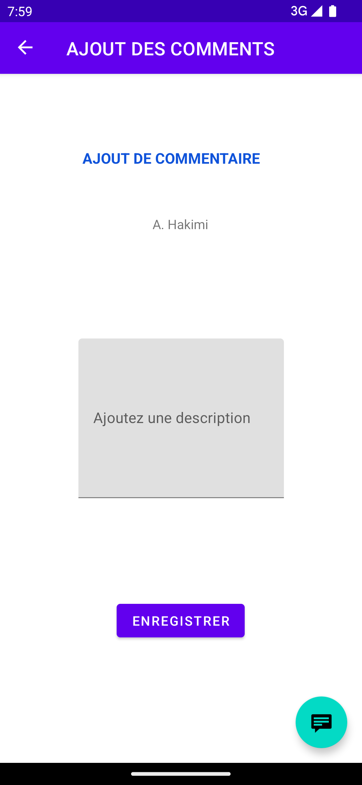
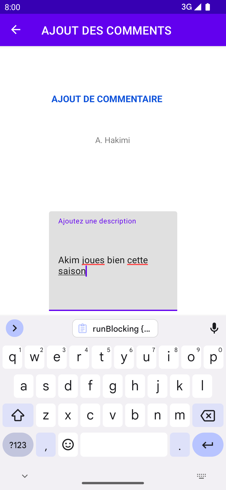
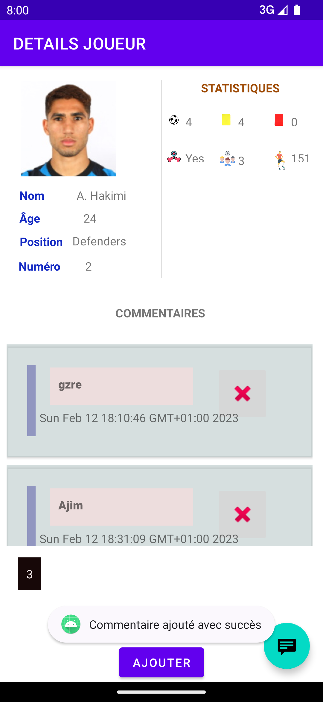

Suivi des statistiques des joueurs de football
===================================

Cette application conçue pour afficher la liste d'un nombre de joueurs professionnels, avec leurs statistiques individuelles, leur informations professionnelles,

* L'utilité est de permettre à l'utilisateur de commenter ces differentes stats au fur et à mesures quelles changes.
* Le but de cette application est principalement de suivre l'évolution d'un joueur au cours d'une saison.

FOOTAPP est un exemple d'application de statistiques des joueurs, construit avec
[Jetpack Compose] (https://developer.android.com/jetpack/compose). Le but de l'échantillon est de
présenter les capacités actuelles de l'interface utilisateur de Compose.

Pour essayer cet exemple d'application, utilisez la dernière version stable
de [Android Studio](https://developer.android.com/studio).
Vous pouvez cloner ce dépôt ou importer le
projet d'Android Studio en suivant les étapes
[ici](https://developer.android.com/jetpack/compose/setup#sample).

## Captures d'écran

Importation
---------------

Pour créer ce projet, utilisez "Importer un projet" dans Android Studio.

Caractéristiques
---------------

L'application comporte trois composants principaux : la liste complète des joueurs de la ligue 1, la liste des commentaires écrits sur un joueur ,les statistiques individuelles des joueurs et leur statistiques dans leur club. Pour les commentaires l'utilisateur est appelé à :
- Voir le nombre de commentaires fait sur un joueurs, 
- il peut supprimer mais pas modifier,
- l'ajout d'un commentaire se fait en rentrant uniquement le texte (commentaire) et le système s'en charge du reste à savoir : la date , les information sur le joueur.

   
   
   
   
   

Architecture
---------------

L'architecture est presque entièrement construite autour des [composants de l'architecture Android](https://developer.android.com/topic/libraries/architecture/).

Cela a été un long processus car j'ai initialement créé l'application sans suivre les guides d'architecture d'applications d'Android. Par conséquent, j'ai migré lentement l'application. Cela inclut l'utilisation du [composant de navigation](https://developer.android.com/guide/navigation) pour réduire le nombre d'activités, en faveur des fragments, et rendre généralement le code plus idiomatique. J'ai également fait la transition vers l'utilisation de [ViewModel](https://developer.android.com/topic/libraries/architecture/viewmodel)s pour aider à séparer la logique et le code lié à l'interface utilisateur. L'application utilise également [view binding](https://developer.android.com/topic/libraries/view-binding) pour éliminer le risque de pointeurs nuls et supprimer également le besoin de types de codage explicites.

Room
---------------

La persistance des données 

APIFOOTBALL
---------------
La liste complète des joueurs ainsi que leur statistiques sont récuperer via l'API REST <a href="https://apiv3.apifootball.com">APIFOOTBALL<a/> : un fournisseur des données footbalistiques, il fournit une base complète des joueurs ainsi leur stats de manière permanente.

Kotlin
---------------

À l'été 2020, j'ai décidé de réécrire l'intégralité de l'application en Kotlin. Il y avait de nombreuses raisons à cela, y compris, mais sans s'y limiter, un code plus idiomatique, une sécurité nulle, une inférence de type, des classes plus intelligentes et moins de code passe-partout. J'ai également tiré parti de la fonctionnalité améliorée fournie par les [extensions Android KTX] (https://developer.android.com/kotlin/ktx).

# License

**Now in Android** is distributed under the terms of the Apache License (Version 2.0). See the
[license](LICENSE) for more information.